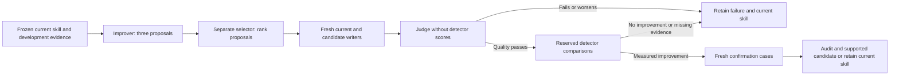

# Skill autoresearch

The workflow coordinates a skill improver, a separate preference selector, fresh output writers, a judge who cannot see scores, and detector workers. A local controller preserves frozen versions, resumes interrupted work and checks the evidence before a candidate can advance. Start it through an agent with subagents and supported Chrome controls:

The supplied configuration measures prose independently of code. Review the complete message and its code for correctness, then scan the exact prose after approved code exclusions. Keep inline technical names and all explanatory sentences. Results identify their scope; earlier whole-message scores remain historical whole-message measurements.

> Use the anti-detection-writing skill's bounded autoresearch workflow. Run one round within the existing free detector allowance, compare the current skill with a proposed skill change, and reserve fresh cases for confirmation. Preserve all failures and stop at the recorded budget.

Read the [workflow and commands](../skills/anti-detection-writing/references/autoresearch.md), [role packets](../skills/anti-detection-writing/references/autoresearch/roles.md), [default limits](../skills/anti-detection-writing/references/autoresearch/config.json) and [native receipt contract](../skills/anti-detection-writing/references/autoresearch/receipt-contract.md).

The selection design follows [AI Research Preference Models](https://arxiv.org/html/2608.13940v2#S3): use relative judgments over proposed changes and measured history to decide which experiment deserves scarce execution budget. Our quality gate, writing cases, detector receipts and confirmation thresholds are an adaptation; the paper does not validate them. The first implementation uses inference-only selection, not agentic GPU pilots or a trained preference model.

GPTZero and Pangram provide observed detector outcomes, not ground truth for correctness, human authorship or usefulness. Those distinctions stay explicit in reviews and reports. The default pilot requires at least five percentage points of mean GPTZero AI-confidence reduction, no case regression, and no quality regression on both development and confirmation cases. Two cases per split are a small pilot, not evidence of general reliability.

The controller executes no model or browser calls on its own. The active agent follows the returned pending jobs, and can resume the ledger on a later invocation. Recurring execution needs a separately requested scheduler and an overall budget; creating more run directories does not replenish allowance. No automatic installation, public answers, account purchases or repository push occurs.

The [setup validation](autoresearch-validation.md) records the tests, archived detector compatibility checks and first agent round, which stopped at the quality gate before spending detector allowance.
